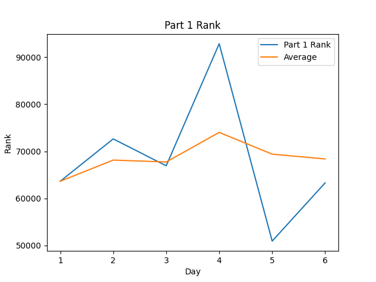
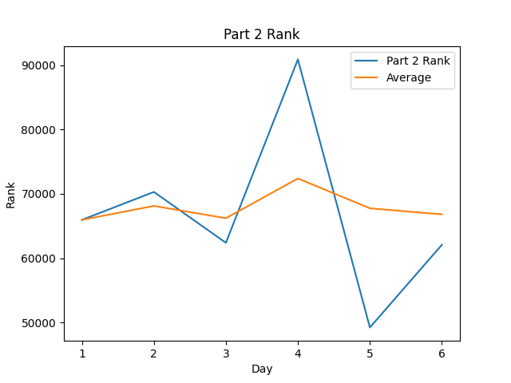
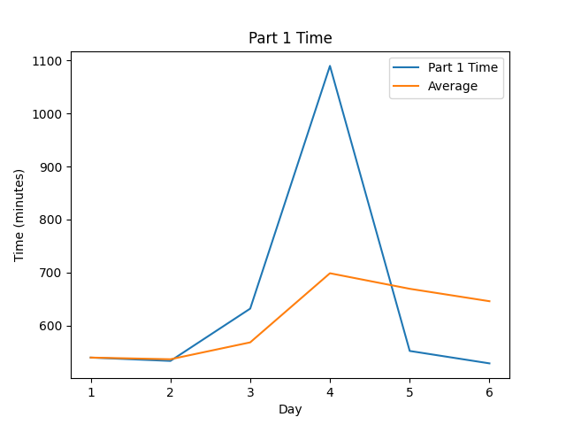
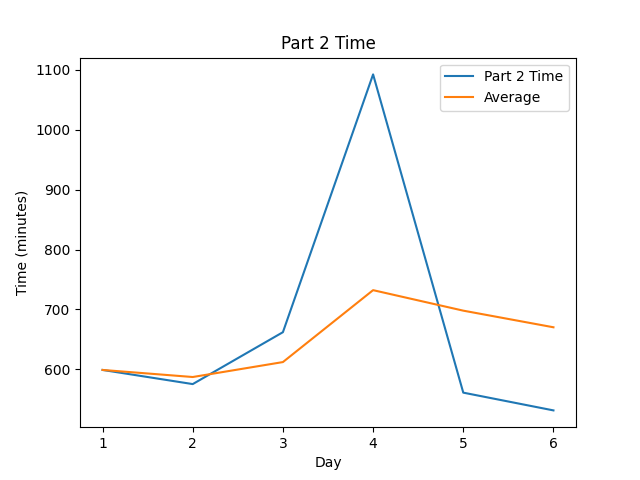

# AoC-Template

[Advent of Code](https://adventofcode.com) Solutions for 2022 in Rust.

## Highlights:

#### Favorite problems:

-

#### Interesting approaches:

-

#### Leaderboard appearances:

-

## Stats

| Day | Part 1 Time (Rank) | Part 2 Time (Rank) |
| --: | ------------------ | ------------------ |
|   1 | 08:59:38 (63642)   | 09:59:03 (63642)   |
|   2 | 08:53:19 (72631)   | 09:35:26 (72631)   |
|   3 | 10:31:59 (66923)   | 11:02:05 (66923)   |
|   4 | 18:10:01 (92839)   | 18:12:32 (92839)   |
|   5 | 09:12:08 (50933)   | 09:21:09 (50933)   |
|   6 | 08:48:41 (63302)   | 08:51:30 (63302)   |
| Avg | 10:45:57 (68378)   | 11:10:17 (66812)   |

<!--suppress CheckImageSize -->

 
 

Note: Times are from time of challenge release, not start time to completion time

## Scripting initially based on a script from [Ullaakut](https://github.com/Ullaakut/aoc19). Expanded upon and fixed by [HBiede](https://github.com/hbiede)

#### Makefile Automation

- Automatically downloads the challenge and input for the day (e.g.: `make download DAY=03`)
  - In order to use this target, you need to specify your session cookie from adventofcode.com in cookies.txt through the usage of `make cookie SESSION={Insert your session cookie here}`.
  - Parses the challenge into a markdown file (adds Markdown style headers and code blocks).
- Setup the new day's source file from a template file while downloading the input and challenge per above (e.g.: `make DAY=03`)
- Create the stats table above by calling `make stats`
  - May require calling `pip3 install -r requirements.txt` to ensure you have all the necessary python dependencies
